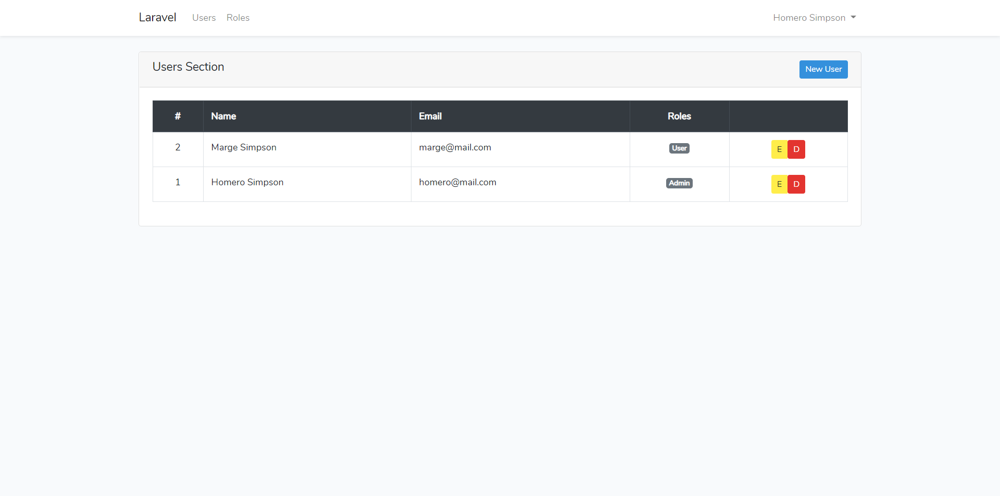

**<a href="https://github.com/dcyar/laravel-user-role-scaffold" target="_blank">Laravel User-Role Scaffold</a>** es un proyecto base para cualquier proyecto que requiera el uso de roles de usuario.



<br />

> Puedes ver mas en el repositorio del proyecto: <a href="https://github.com/dcyar/laravel-user-role-scaffold" target="_blank">Laravel User-Role Scaffold</a>

## Caracteristicas del Sistema:
- Roles de usuarios.
- Middleware en rutas.

``` php
// use middleware on a route
Route::get('/users', function () {
  // do anything
})->middleware('role:admin');
```

- Directivas en blade.

```php
// You can use the scope of the User model
@if(Auth::user()->hasRole('admin'))
    // 
@endif

// You can also use the blade directive
@role('admin')
    // 
@endrole
```
<br />

> Puedes ver mas en el repositorio del proyecto: <a href="https://github.com/dcyar/laravel-user-role-scaffold" target="_blank">Laravel User-Role Scaffold</a>