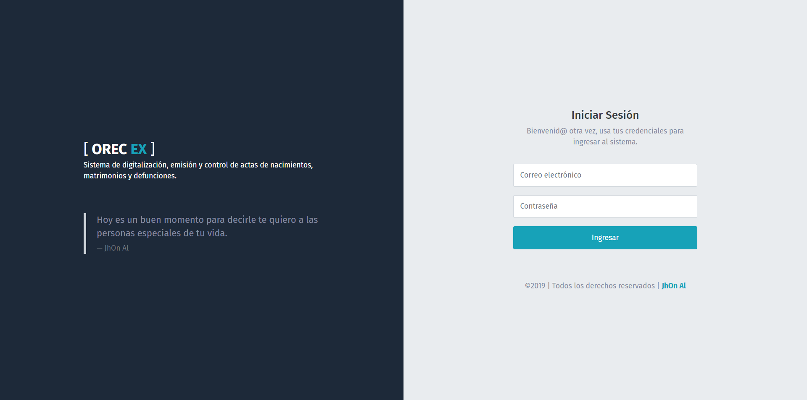
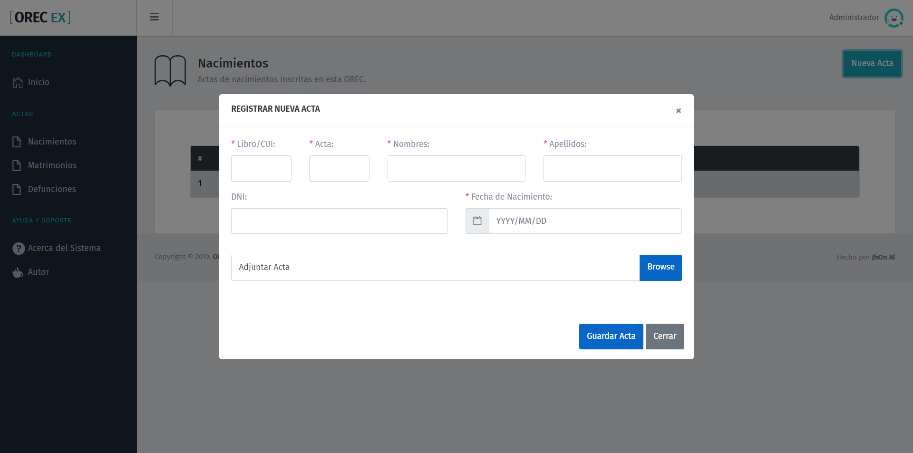
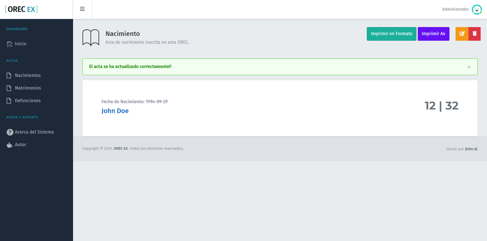

**OREC-EX** es un proyecto Open Source para la digitalizacion, emision y control de actas (nacimientos, matrimonios, defunciones) en las *Oficinas de Registros del Estado Civil*, que hay en distintos, distritos o provincias a nivel nacional.

**Caracteristicas del Sistema:**
- Registro de Actas.
- Digitalizacion de Actas.
- Expedicion de Actas.
- Busqueda de Actas.

**Proximas Caracteristicas**
- Registro y expedicion de tramites (Contancias de solteria, etc...).
- Control de plantillas para expedicion.

*Les dejo algunas capturas del sistema.*

Actualmente estoy trabajando en el **manual de uso** y la **documentacion del sistema**, que estaran disponibles pronto.

Si deseas usar el sistema y necesitas ayuda con la instalacion o el uso, puedes contactarme al siguiente email: ***jachata.m@gmail.com***