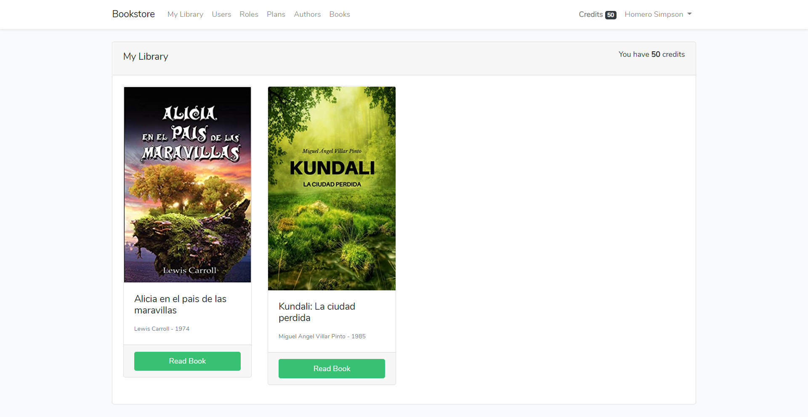
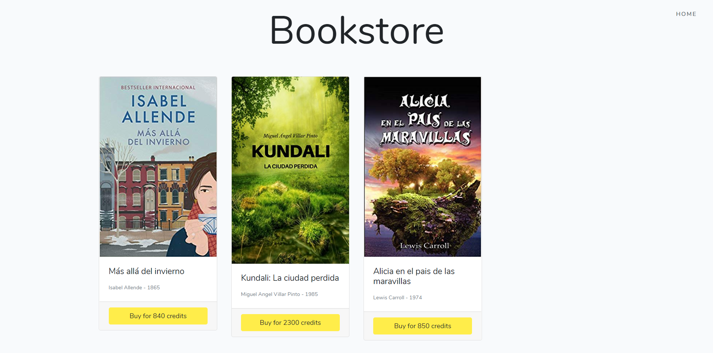
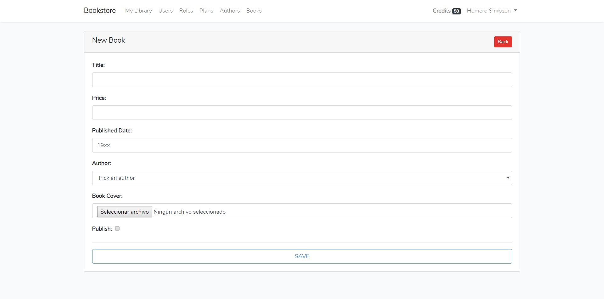
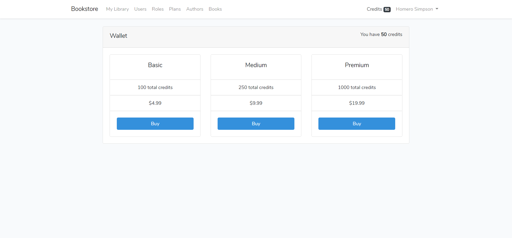

**<a href="https://github.com/dcyar/bookstore" target="_blank">Laravel Bookstore</a>** es un proyecto Open Source de ecommerce con lo basico de la funcionalidad que podria tener una tienda en linea.

**Caracteristicas del Sistema:**
- Panel de administracion (Usuarios, Roles, Planes, Autores, Libros).
- Cartera de usuario.
- Biblioteca de usuario.

*Les dejo algunas capturas del sistema.*

Si deseas usar el sistema y necesitas ayuda con la instalacion o el uso, puedes contactarme al siguiente email: ***jachata.m@gmail.com***

> Puedes acceder a una copia del sistema desde aqui <a href="https://github.com/dcyar/bookstore" target="_blank">Laravel Bookstore</a>